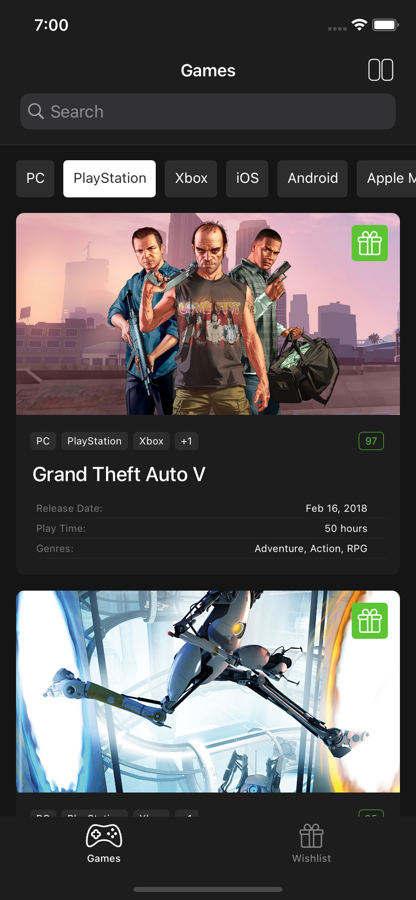
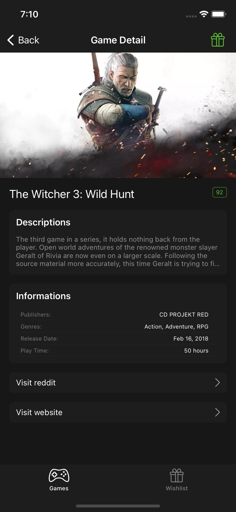

# Game Platform App

## Intro
- The application consists of 2 tabs and 3 separate pages in total. GameList, GameDetail and WishList.

## GameList
- Games are listed on the Game List page, they can be filtered according to the selected platform, and a certain word can be searched at the same time.
- Maximum 1 filter can be selected at the same time, clicking the same filter again will remove the selection.
- The button above provides the layout change on the homepage.
- The page uses the pagination structure.

## GameList BigCard
- The platforms supported by the game are shown above the name of the game. If the number of platforms it supports is more than 3, it is written as + the remaining number. (Example: If it supports 5 platforms, write the first 3 and write +2 in the 4th field)
- The metacritic value of the game is displayed and it is green between 100-75, yellow between 75-50 and red between 50-0.
- If the game has release date, genre, play time information, it is displayed under the game name.
- The game can be added to and removed from the wishlist by clicking on the gift icon on the card. Green icon if added, gray icon if removed.

## GameList SmallCard
- When the layout button on the top right is clicked, the design will change and two columns will appear in one row, if I click the button again, it will return to its previous design.
- The game can be added to and removed from the wishlist by clicking on the gift icon on the card. Green icon if added, gray icon if removed.
- The name of the game can be 2 lines, if it does not fit, there will be punctuation at the end. Even if it is a single line, the card size must be the same as the two lines.

## GameList Search
- When clicking on the search bar and typing a word, the search will not be performed, only when the enter key is pressed.
- When the page is scrolled down, the platforms part is hidden, when the list is scrolled back to the top, the platforms are visible.
- If the word typed on the search screen does not match any game, the empty state view is displayed.

 

## GameDetail
- When we click on a game from the Games screen, it directs to the detail page of the game with the navigation controller.
- The game name can be up to 1 line on the detail page.
- For the Metacritic score, the rules on the previous page apply.
- In the Informations area, there is a release date, genre, play time, publisher section.
- When we click on the Visit Reddit and Visit Website card, it should open the link in Safari.
- On the detail page, there is an add/remove button to the wishlist in the area where the name of the page is written. If a game is added to the wishlist from here, we can see it added to the wishlist both on the homepage and in the favorites tab.

## WishList
- Games that have been added to the Wishlist should be displayed here.
- Cards here should only appear as small cards.
- If no game has been added to the wishlist before, the empty state view should appear.
- When we press the wishlist button on a card on this page, the game is removed from the list.
- Clicking on game cards will not redirect to detail page.

 
